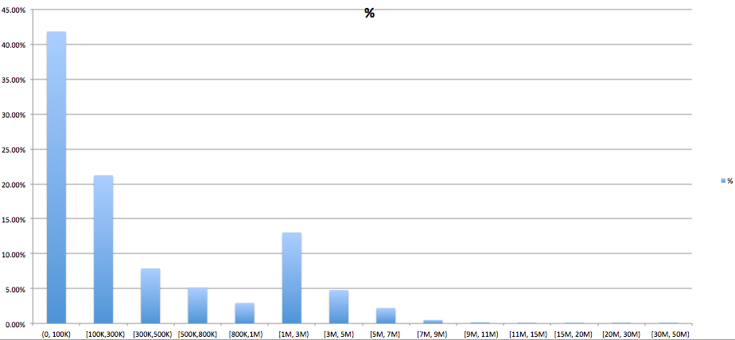
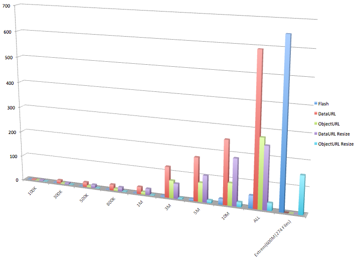
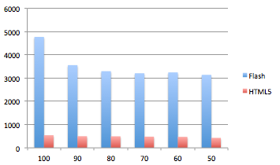
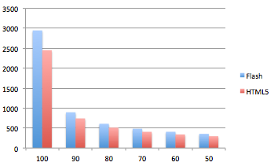

文件（图片）上传调研
=================

* [浏览器占有率](#%E6%B5%8F%E8%A7%88%E5%99%A8%E5%8D%A0%E6%9C%89%E7%8E%87)
* [功能调研](#%E5%8A%9F%E8%83%BD%E8%B0%83%E7%A0%94)
    * [文件选择](#%E6%96%87%E4%BB%B6%E9%80%89%E6%8B%A9)
    * [文件信息](#%E6%96%87%E4%BB%B6%E4%BF%A1%E6%81%AF)
    * [文件内容读取](#%E6%96%87%E4%BB%B6%E5%86%85%E5%AE%B9%E8%AF%BB%E5%8F%96)
    * [图片预览](#%E5%9B%BE%E7%89%87%E9%A2%84%E8%A7%88)
    * [图片裁剪](#%E5%9B%BE%E7%89%87%E8%A3%81%E5%89%AA)
    * [图片压缩](#%E5%9B%BE%E7%89%87%E5%8E%8B%E7%BC%A9)
    * [Javascript 与 Flash通信](#javascript-%E4%B8%8E-flash%E9%80%9A%E4%BF%A1)
    * [异步文件上传](#%E5%BC%82%E6%AD%A5%E6%96%87%E4%BB%B6%E4%B8%8A%E4%BC%A0)
* [性能评测](#%E6%80%A7%E8%83%BD%E8%AF%84%E6%B5%8B)
    * [预览](#%E9%A2%84%E8%A7%88)
    * [压缩](#%E5%8E%8B%E7%BC%A9)
* [评测总结](#%E8%AF%84%E6%B5%8B%E6%80%BB%E7%BB%93)
* [结论](#%E7%BB%93%E8%AE%BA)

## 浏览器占有率

来源:百度相册

浏览器占有率

<table>
    <tr>
        <th>浏览器</th><th>占有率</th>
    </tr>
    <tr><td>Chrome</td><td>52.94%</td></tr>
    <tr><td>IE</td><td>44.32%</td></tr>
    <tr><td>FF</td><td>1.97%</td></tr>
</table>

IE版本占有率

<table>
    <tr>
        <th>浏览器</th><th>占有率</th>
    </tr>
    <tr><td>IE6</td><td>6.55%</td></tr>
    <tr><td>IE7</td><td>0.57%</td></tr>
    <tr><td>IE8</td><td>27.33%</td></tr>
    <tr><td>IE9</td><td>9.87%</td></tr>
    <tr><td>IE10</td><td>&lt;5%</td></tr>
</table>

## 上传数据统计

来源：百度相册

<table>
<tr>
<th>大小区间</th><th>(0,100K)</th><th>[100K,300K)</th><th>[300K,500K)</th><th>[500K,800K)</th><th>[800K,1M)</th><th>[1M,3M)</th><th>[3M,5M)</th><th>[5M,7M)</th><th>[7M,9M)</th><th>[9M,11M)</th><th>[11M,15M)</th><th>[15M,20M)</th><th>[20M,30M)</th><th>[30M,50M)</th>
</tr>
<tr>
<th>百分比</th><td>41.86%</td><td>21.25%</td><td>7.89%</td><td>5.18%</td><td>2.94%</td><td>13.04%</td><td>4.78%</td><td>2.22%</td><td>0.50%</td><td>0.16%</td><td>0.11%</td><td>0.04%</td><td>0.02%</td><td>0.01%
</td>
</tr>
</table>

## 功能调研

### 文件选择

<table>
    <tr>
        <th>方式</th><th>IE6</th><th>IE7</th><th>IE8</th><th>IE9</th><th>IE10</th><th>Chrome</th><th>FF</th>
    </tr>
    <tr>
        <td>单选</td>
        <td>O</td>
        <td>O</td>
        <td>O</td>
        <td>O</td>
        <td>O</td>
        <td>O</td>
        <td>O</td>
    </tr>
    <tr>
        <td>多选</td>
        <td>X</td>
        <td>X</td>
        <td>X</td>
        <td>X</td>
        <td>O</td>
        <td>O</td>
        <td>O</td>
    </tr>
    <tr>
        <td>拖拽</td>
        <td>X</td>
        <td>X</td>
        <td>X</td>
        <td>X</td>
        <td>O</td>
        <td>O</td>
        <td>O</td>
    </tr>
</table>

### 文件信息

<table>
    <tr>
        <th>属性</th><th>说明</th><th>IE9</th><th>IE10</th><th>Chrome</th><th>FF</th><th>iOS</th><th>Android</th>
    </tr>
    <tr>
        <td>name</td>
        <td>文件名称</td>
        <td>X</td>
        <td>O</td>
        <td>O</td>
        <td>O</td>
        <td>6.0</td>
        <td>3.0</td>
    </tr>
    <tr>
        <td>lastModifiedDate</td>
        <td>文件最后修改日期</td>
        <td>X</td>
        <td>O</td>
        <td>O</td>
        <td>O</td>
        <td>6.0</td>
        <td>3.0</td>
    </tr>
    <tr>
        <td>size</td>
        <td>文件大小</td>
        <td>X</td>
        <td>O</td>
        <td>O</td>
        <td>O</td>
        <td>6.0</td>
        <td>3.0</td>
    </tr>
    <tr>
        <td>type</td>
        <td>文件类型，HTTP协议中Content-Type格式。</td>
        <td>X</td>
        <td>O</td>
        <td>O</td>
        <td>O</td>
        <td>6.0</td>
        <td>3.0</td>
    </tr>
</table>

### 文件内容读取

<table>
    <tr>
        <th>方法</th><th>说明</th><th>IE10</th><th>Chrome</th><th>FF</th><th>iOS</th><th>Android</th>
    </tr>
    <tr>
        <td>readAsDataURL</td>
        <td>按DataURL格式读取文件内容，适用于图片文件。</td>
        <td>O</td>
        <td>O</td>
        <td>O</td>
        <td>6.0</td>
        <td>3.0</td>
    </tr>
    <tr>
        <td>readAsText</td>
        <td>读取文本文件内容。</td>
        <td>O</td>
        <td>O</td>
        <td>O</td>
        <td>6.0</td>
        <td>3.0</td>
    </tr>
    <tr>
        <td>readAsArrayBuffer</td>
        <td>按字节读取。</td>
        <td>O</td>
        <td>O</td>
        <td>O</td>
        <td>6.0</td>
        <td>3.0</td>
    </tr>
    <tr>
        <td>readAsBinaryString</td>
        <td>读取文件并返回二进制字符串。</td>
        <td>X</td>
        <td>O</td>
        <td>O</td>
        <td>6.0</td>
        <td>3.0</td>
    </tr>
</table>

### 图片预览

<table>
    <tr>
        <th>方式</th><th>IE10</th><th>Chrome</th><th>FF</th><th>iOS</th><th>Android</th>
    </tr>
    <tr>
        <td>readAsDataURL</td>
        <td>O</td>
        <td>O</td>
        <td>O</td>
        <td>6.0</td>
        <td>3.0</td>
    </tr>
    <tr>
        <td>createObjectURL</td>
        <td>O</td>
        <td>O</td>
        <td>O</td>
        <td>6.0</td>
        <td>4.0</td>
    </tr>
</table>

### 图片裁剪

<table>
    <tr>
        <th>IE10</th><th>Chrome</th><th>FF</th><th>iOS</th><th>Android</th>
    </tr>
    <tr>
        <td>O</td>
        <td>O</td>
        <td>O</td>
        <td>6.0</td>
        <td>3.0</td>
    </tr>
</table>

### 图片压缩

<table>
    <tr>
        <th>IE10</th><th>Chrome</th><th>FF</th><th>iOS</th><th>Android</th>
    </tr>
    <tr>
        <td>O</td>
        <td>O</td>
        <td>O</td>
        <td>6.0</td>
        <td>3.0</td>
    </tr>
</table>

### Javascript 与 Flash通信

考虑到Javascript在某些情况下的局限性，可能需要与Flash协作，因此需要Javascript具有与Flash通信的能力。

序列化数据通信：支持；但是需要读取文件序列化后的内容，比如BASE64，内存占用可能会比较大；

二进制数据通信：待验证；

### 异步文件上传

<table>
    <tr>
        <th>方式</th><th>说明</th><th>IE10</th><th>Chrome</th><th>FF</th>
    </tr>
    <tr>
        <td>XHR send(FormData)</td>
        <td>构造FormData发送，HTTP请求与FORM提交一致，后端端无需做额外适配通用。</td>
        <td>O</td>
        <td>O</td>
        <td>O</td>
    </tr>
    <tr>
        <td>XHR sendAsBinary</td>
        <td>结合FileReader的readAsBinaryString使用。</td>
        <td>X</td>
        <td>O1</td>
        <td>O</td>
    </tr>
    <tr>
        <td>XHR send(Blob)</td>
        <td>直接发送File对象，浏览器不会进行编码而是直接把Blob内容作为POST DATA，需要后端自行解析。</td>
        <td>O*</td>
        <td>O*</td>
        <td>O*</td>
    </tr>
    <tr>
        <td>XHR send Base64</td>
        <td>通过FileReader的readAsDataURL方法获取图片Base64编码，以文本方式发送到后端处理，需要后端自行解析。</td>
        <td>O*</td>
        <td>O*</td>
        <td>O*</td>
    </tr>
    <tr>
        <td>WebSocket send binary</td>
        <td>通过FileReader获得Blob或ArrayBuffer，通过WebSocket发送到后端，需要后端获取数据并解析。</td>
        <td>O*</td>
        <td>O*</td>
        <td>O*</td>
    </tr>
</table>

1可模拟；
*服务器端需要适配；

## 性能评测

评测的两个方面：

* HTML5与Flash共同拥有的功能进行对比；
* HTML5某个功能的不同实现进行比较；

### 预览

图片预览在HTML5和Flash均可实现，同时HTML5本身有两种实现方式，因此同时参与评测。

下图为使用`Flash`、`HTML5 DataURL`、`HTML5 ObjectURL`、`HTML5 DataURL with resize`、`HTML5 ObjectURL with resize`五种方式进行图片预览时所消耗的内存比较：

<table>
    <tr>
        <th>方式</th><th>  100K    </th><th>300K   </th><th>500K   </th><th>800K   </th><th>1M </th><th>3M </th><th>5M </th><th>10M    </th><th>ALL</th><th>Extreme(600M / 274 Files)</th>
    </tr>
    <tr>
        <td>Flash   </td><td>1  </td><td>1  </td><td>1  </td><td>1  </td><td>1  </td><td>4  </td><td>7  </td><td>22 </td><td>50</td><td>650</td>
    </tr>
    <tr>
        <td>H5 DataURL  </td><td>2.6    </td><td>12.6   </td><td>18.2   </td><td>22.7   </td><td>27.6   </td><td>122    </td><td>172    </td><td>252    </td><td>591</td><td>N/A</td>
    </tr>
    <tr>
        <td>H5 ObjectURL    </td><td>1.1    </td><td>3.5    </td><td>6.1    </td><td>8.4    </td><td>9.5    </td><td>69 </td><td>75 </td><td>88 </td><td>274</td><td>N/A</td>
    </tr>
    <tr>
        <td>H5 DataURL Resize</td><td>  4.2 </td><td>6.5    </td><td>12 </td><td>16 </td><td>24 </td><td>59 </td><td>105    </td><td>185    </td><td>245</td><td>N/A</td>
    </tr>
    <tr>
    <td>H5 ObjectURL Resize</td><td> 1   </td><td>1   </td><td>1   </td><td>1.7 </td><td>1.7 </td><td>4.5 </td><td>10.5    </td><td>18  </td><td>30  </td><td>150</td>
    </tr>
</table>

测试时依次预览100K、300K、500K、800K、1M、3M、5M和10M的图片，以及批量预览上述图片，而针对`Flash`以及`ObjectURL with resize`还进行了批量274个图片文件共计600M大小的预览测试。

从测试结果来看，`HTML5 ObjectURL with resize`方案最理想，尤其在批量上传时内存能够有效的回收；其次是`Flash`，但在批量上传时内存回收不明显，剩余其他几个方案内存消耗都比较大。

### 压缩

压缩测试是针对一张10M（5134*3456px）JPEG图片，按不同压缩质量压缩，比较压缩后的图片大小以及压缩所消耗的时间。

#### HTML5 ObjectURL

<table>
    <tr>
        <th>图片质量(%)</th><td>100</td><td>90</td><td>80</td><td>70</td><td>60</td><td>50</td>
    </tr>
    <tr>
        <th>耗时(ms)</th><td>543</td><td>500</td><td>495</td><td>481</td><td>472</td><td>428</td>
    </tr>
    <tr>
        <th>大小(KB)</th><td>2449</td><td>741</td><td>512</td><td>406</td><td>340</td><td>296</td>
    </tr>
</table>        

#### Flash    

<table>
    <tr>    
        <th>图片质量(%) </th><td>100 </td><td>90  </td><td>80  </td><td>70  </td><td>60  </td><td>50</td>
    </tr>
    <tr>
        <th>耗时(ms)  </th><td>4768    </td><td>3555    </td><td>3295    </td><td>3205   </td><td> 3243    </td><td>3137</td>
    </tr>
    <tr>
        <th>大小(KB)  </th><td>2945    </td><td>895 </td><td>608 </td><td>483 </td><td>407 </td><td>356</td>
    </tr>
</table>    

压缩耗时比较

压缩大小比较

从测试数据来看，相同质量下，Flash压缩后的图片比HTML5的要大20%左右，而Flash压缩所消耗的时间则是HTML5的3.5倍。

## 评测总结

 * __兼容性__：与HTML5相比，Flash兼容性在PC端全面占优，但是在移动端则正好相反；HTML5在IE10+、Chrome以及Firefox中均有较好的兼容性和稳定性；
 * __能力__：Flash在文件上传方面的功能HTML5均能覆盖，包括多选、剪裁、压缩、预览、异步上传等，而且HTML5还能通过拖拽来选择文件，因此在这方面HTML5更具优势；
 * __性能__：在图片预览和压缩两种操作中，无论是内存消耗还是时间消耗，HTML5的性能都由于Flash；此外，使用HTML5实现时需要载入的文件比Flash更小，在载入速度方面HTML5也占据优势；

## 结论

从评测数据来看，HTML5在可用的环境中各方面均优于Flash，因此对于Chrome、IE10+、Firefox、Safari等支持HTML5的环境中使用HTML5完整实现上传功能，而在不支持HTML5的环境中使用Flash。

此外，尽量不考虑在HTML4环境中使用JS来实现批量的文件上传功能，一方面需要考虑各种兼容性问题，这会给稳定性带来考验；另一方面，HTML4环境中如果需要实现图片预览将会遇到很多问题，很可能需要在JS版本中维护多套实现；总之，在HTML4中实现JS的批量上传是一件投入产出比很低的事情。

